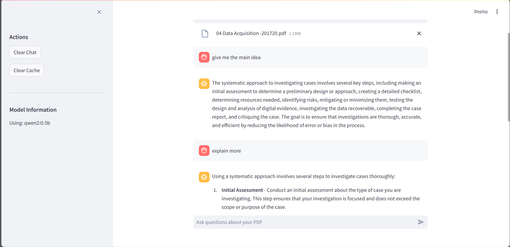

# 💬 PDF Chat App with Ollama and RAG

Chat with your PDF files using powerful local language models (LLMs) and Retrieval-Augmented Generation (RAG).  
Built with **Streamlit**, **LangChain**, **ChromaDB**, and **Ollama** — all running inside a single Docker container.

## Image Demo

